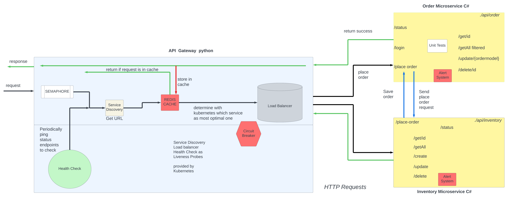

## Project outline

### Project design

The essense of the project is to allow only authorized users to specific operations for inventory management. 

#### How it works

1. Firstly we need to register a user so we can call the register endpoint.
2. Then we need to authorize the user so we login and the login in stored in cache so you do not log in twice for example.
3. Then using this login token the user can call the other inventory microservice to perform curd operations on the entities.
4. The user can access the inventory items without the token as get requests will be public.
5. Once a request is sent to inventory microservice, it calls the user microservice to valdiate the token and if the token is valid then the request can be performed.
6. The request is returned and is stored in cache.

Service discovery and load balancing as well as regular health checks will eventually be implemented using kubernetes as it is convenient to use an all in one platform

For the service load I might consider other approaches for load balancing.

All requests will be sent using http protocols.
